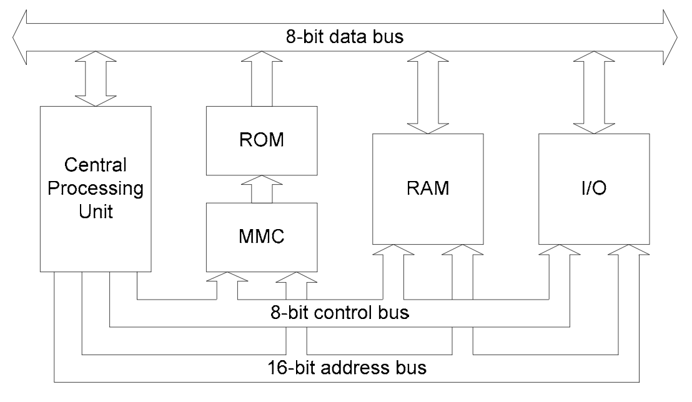

# Welcome to the emnes documentation!

## Getting started

[Setting up the development environment](dev_env.md)

## Overval design

The emulator follows a very simple design. Take this processor diagram, taken on page 9
from [NESDOC.pdf](http://nesdev.com/NESDoc.pdf)

The CPU talks to a memory bus, which talks to different components: RAM, cartridge, picture processing unit, audio processing unit, cartridge and input devices. The emulator follows the same structure.

We'll have a [CPU](../emnes/cpu.py) class that talks to [MemoryBus](../emnes/memory_bus.py) class. That class will be responsible for routing
memory access to the right device.

## Code structure

| Folder           | Description  |
| ---------------- | --------------------------------------------------------------------------------------- |
| `emnes`          | Contains the main emulator classes: `CPU`, `MemoryBus`, `CartridgeReader`, `NES`, `PPU` |
| `emnes/mappers`  | Contains the classes that handle IO with the cartridge. The main class is `MapperBase`  |
| `emnes/apu`      | Contains the implementation of all the components from the audio processing unit (APU)  |
| `emnes/readers`  | Contains the classes that parse roms from disk.                                         |

## Compromises

This emulator strives to be accurate, but some concessions were made in order to get it working at a reasonable speed. Emulating a console using Python is slow, even when leveraging PyPy. As many other accurate emulators, the CPU drives the emulation of the other parts of the computer. If the CPU ticks once, the PPU ticks 3 times and the APU ticks once.

Contrary to a really accurate emulator, where all components ticks at the same time, this emulator first execute an instruction, takes note of how many cycles were executed and executes 3 times as many PPU cycles and as many APU cycles. The original plan was to interleave the CPU cycles with the PPU and APU inside the `CPU._tick` method, but unfortunately this slowed the emulator too much, hence the compromise.

Not implemented are various quirks of the hardware like corruption of DMA transfers. The audio IRQ is also not implemented.

## Understanding the emulator

Great care has been taken to put as much comments as possible into the code. However, the reality is that probably not a lot of people are going to actually be looking at the code. Thank you for making it this far. As such, reading the code is not a substitute for reading good documentation on the NES. If you've been struggling with your emulator however, hopefully the code from this emulator is documented well enough that it may help you fix yours.

## Documents to read

Writing an emulator is a complex task, but thankfully a lot of clever people have figured out how things work over the years. If the documentation is followed properly, a CPU can be completed very quickly.

The following resources were consulted while working on this emulator:

### General NES documentation

[NESDoc](http://nesdev.com/NESDoc.pdf): The best introduction to the internals of the NES. It doesn't go into the details, but it gives an understanding of the task at hand and the different parts that need to be emulated.

[wiki.nesdev.com](http://wiki.nesdev.com): This is a treasure trove of information on how to emulate or program for the NES. Most of the links below will be to subsections of this site.

### CPU documentation

[2A03 CPU Reference](http://obelisk.me.uk/6502/reference.html): Very clean and concise guide to the NES CPU instruction set.

[MCS 6500 Microcomputer Family Programming Manual](http://archive.6502.org/books/mcs6500_family_programming_manual.pdf): Guide for the 6500 CPU family. This covers the instruction set in great detail and explains how the CPU reacts in the various addressing modes and the small glitches in some of them.

[Easy 6502](https://skilldrick.github.io/easy6502/#stack): This is an online emulator for the 6502 CPU. Very useful to debug a set of instructions and understand how bits are set.

[64doc](http://atarihq.com/danb/files/64doc.txt) This is the Commodore 64 CPU timings documentation, which is the same CPU as the NES. It fully documents when the CPU ticks. To write a CPU that is clocked accurately, this is the document to read.

### PPU documentation

[NesDev's wiki](http://wiki.nesdev.com/w/index.php/PPU): The majority of this emulator's PPU is based on what is found at this page. There isn't any need to really look at other resources to understand how the PPU works, althought there are other sites that present some of the information in simpler fashion.

[PPU (RP2C02) Nintendo NES Documentation](https://docs.google.com/document/d/1mLIbnKyXrYkLBGxV83oBb-vO0U48FQMkeGNTW4fspZQ/mobilebasic): This document is really great. It repeats some of the information from the NesDev wiki, but accompanies it with a lot of visuals showing the contents of the PPU memory.

### APU documentation

[apu_ref.txt](http://nesdev.com/apu_ref.txt): When it comes to the APU, there is only one document to read: `apu_ref.txt`. It goes through all the details of how the APU works. This is by far the most modular part of the console and lends itself very well to multiple simple classes that get composed together to form a whole. This reflects itself in this emulator's code as the `apu` module which actually a collection of classes.

## Tests

When writing an emulator, a good test suite is primordial to make sure that any changes that are made won't introduce a regression. Thankfully, a lot of clever people have written roms that actually allow to test the behaviour of an emulator. The important tests have been committed to this repository. They can be found [here](../tests/roms/README.md).
